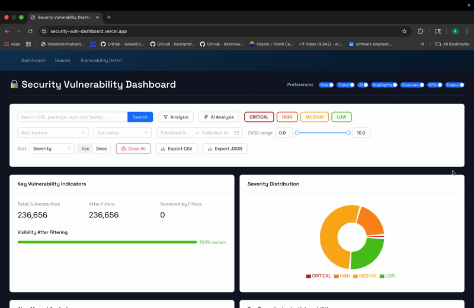

# Security Vulnerability Dashboard

React + Vite dashboard for exploring a very large vulnerability dataset. A
lightweight Express + MongoDB API streams paginated slices and pre-computed
metrics so the browser stays fast even though the source snapshot is 389 MB.

### Recent Updates
- Filter bar debounces auto-complete queries, keeps CVSS sliders bounded, and surfaces active filters as dismissible chips.
- Vulnerability table now renders through a virtual list so thousands of rows stay smooth while infinite scrolling.
- Dashboard preferences persist in `localStorage`, and charts/metrics lean on normalised data helpers for consistent totals.
- Inline documentation was added around the heavier logic (filter plumbing, virtual scroll, metrics math) to make future changes safer.

### Deployment
- Vercel: https://security-vuln-dashboard.vercel.app



## Getting Started

### Prerequisites
- Node.js 18+
- npm (bundled with Node). 

### 1. Clone the repository
```bash
git clone https://github.com/anish/security-vuln-dashboard.git
cd security-vuln-dashboard
```

### 2. Install dependencies
```bash
npm install
```

### 3. Start the API (requires MongoDB running locally or in Atlas)
```bash
cd api
npm install
cp .env.example .env   # update MONGODB_URI if necessary
npm run import         # one-time import from ../public/ui_demo.json
npm run dev            # starts http://localhost:4000
```

### 4. Start the frontend (new terminal)
```bash
cd ..
VITE_API_URL=http://localhost:4000/api npm run dev
```

The browser now pulls paginated data from the API, so the first paint is almost
instant—the heavy lifting happens on the server.

### Deploying to Vercel
- Deploy the API (Render, Railway, Fly.io, a small VM, or Vercel functions) and
  set `MONGODB_URI`, `PORT`, and `CORS_ORIGIN` appropriately.
- Point the frontend at that API by setting `VITE_API_URL=https://your-api.example.com/api`
  in both Preview and Production environments.
- Redeploy the frontend—no static JSON bundling required any more.

### Build for production 
```bash
npm run build
```
Artifacts land in `dist/`.

### Large dataset (Git LFS)
The `public/ui_demo.json` archive weighs ~389 MB. The repository is configured to store it via [Git LFS](https://git-lfs.com/):
```bash
git lfs install
git lfs track "public/ui_demo.json"
git add .gitattributes public/ui_demo.json
```
If the file already exists in history, run `git lfs migrate import --include="public/ui_demo.json"` once to rewrite past commits before pushing.

### Resetting the dataset
Re-run `npm run api:import` whenever you update `public/ui_demo.json`. The
script wipes and reloads MongoDB, and the API immediately serves the new data.


## Architecture Overview

```
Browser (React) ─┬─► REST API (Express)
                 │        │
                 │        └─► MongoDB
                 ▼
        Redux Toolkit store
                 ▼
        Components render via selectors
```

- **Entry point**: `src/main.tsx` wraps `App` with the Redux provider.
- **Routing**: `App.tsx` uses React Router (`/`, `/search`, `/vuln/:id`).
- **Redux slice**: `src/features/vulns/slice.ts` stores the current page, filters,
  sort order, and server-provided metrics.
- **Selectors**: `src/features/vulns/selectors.ts` expose handy views of that
  state for charts, KPIs, and tables.
- **Data ingestion**: The Express API handles pagination/filtering and returns
  aggregated metrics so the browser only fetches what it needs for each view.
- **UI**:
  - `Dashboard.tsx` bootstraps the data (stream if DB empty, otherwise hydrate). It also persists “show/hide” preferences in `localStorage`.
  - Reusable components live under `src/components/` (filters, charts, KPIs, tables, comparisons).
  - `SearchPage` reuses the filter + table stack on a white canvas for focused querying.
- `VulnDetail` fetches an individual record on demand if it is not already in
  the Redux cache.

### Why MongoDB instead of IndexedDB?
- **Size limits**: The 389 MB snapshot plus aggregation indexes pushed past what browsers comfortably store in IndexedDB.
- **Cold start time**: Importing JSON into IndexedDB required a multi-minute first load; MongoDB ships pre-indexed data to the API so the UI paints immediately.
- **Shared access**: MongoDB lets multiple analysts hit the same dataset without each browser carrying a private copy.
- **Server-side aggregations**: We lean on MongoDB pipelines to calculate risk-factor counts, trend lines, and highlights before data reaches the browser.

### Why the API runs on Render (not Vercel functions)
- The `/api/vulnerabilities` endpoint performs heavy aggregation over ~236k docs; serverless timeouts on Vercel’s hobby tier clipped responses.
- Render keeps a warm Node process with no 10 s execution ceiling, so the API can stream full exports and cache connections to Atlas.
- Frontend remains on Vercel—`VITE_API_URL` simply points to the Render Web Service (`https://security-vuln-dashboard.onrender.com/api`).

## Component Architecture & Data Flow

### FilterBar
- Lightweight search and severity filters. Each change dispatches a Redux action
  and triggers `fetchVulnerabilities()` so results stay in sync with the server.

### KPIs & Progress
- `KPIs.tsx` pulls aggregate counts via `selectKPI`. The short progress bar gives quick “filters removed X%” feedback.

### Charts
- `Charts.tsx` exports the visualisations (severity distribution, risk factors,
  monthly trend, AI vs manual analysis, highlights). Each chart reads aggregated
  metrics returned by the API.

### RepoBar & Comparison
- `RepoBar.tsx` aggregates vulns per repo, sliced to the top 15, and colours bars green to align with our palette.
- `VulnComparison.tsx` lets you pick up to three rows and inspect severity, CVSS, and risk factors side-by-side.

### Tables & Detail View
- `VulnTable.tsx` renders the filtered list with pagination and severity colouring. Clicking a row links to `/vuln/:id`.
- `VulnDetail.tsx` fetches a record from the API on demand, shows badges, risk factors, and links out to NVD when we have a CVE.

### Preference Toggles
- Stored under `svd-dashboard-preferences` in `localStorage`, so the dashboard remembers which tiles you’ve hidden. Each toggle simply flips a boolean in local component state; the state persists on layout changes.


## Decisions & Trade-offs

- **Server-first ingestion**: The 389 MB JSON is processed once on the server.
  The browser receives paginated slices, so first paint is fast even on slow
  networks.
- **Composite vulnerability IDs**: Import keeps the
  `group|repo|image|sourceId|ordinal` identifier so duplicate CVEs across repos
  remain unique.
- **Redux Toolkit for shared state**: Filters, pagination, and metrics stay in
  sync across Dashboard, Search, and detail views with a single slice.
- **Ant Design + Recharts**: Still the quickest way to ship tables and charts
  with a consistent look.
- **Local preference persistence**: Layout toggles remain in `localStorage` so
  analysts can customise the dashboard.


## Development Notes

- Dataset lives in `public/ui_demo.json`; re-run `npm run api:import` after making
  changes.
- Configure `MONGODB_URI` for the API and `VITE_API_URL` for the frontend when
  deploying.
- Tests aren’t wired yet. When we stabilise the dataset, we can add store-level tests to verify filtering math.

Happy dashboarding!
